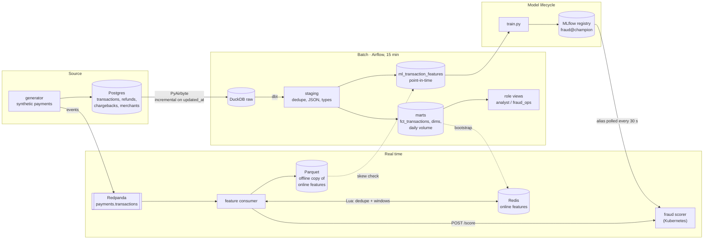
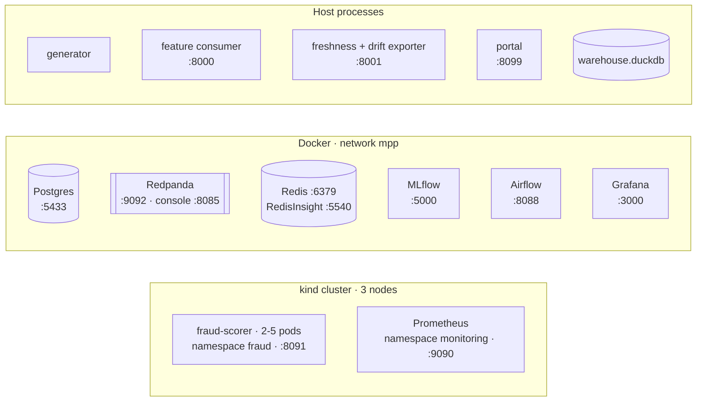
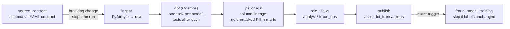
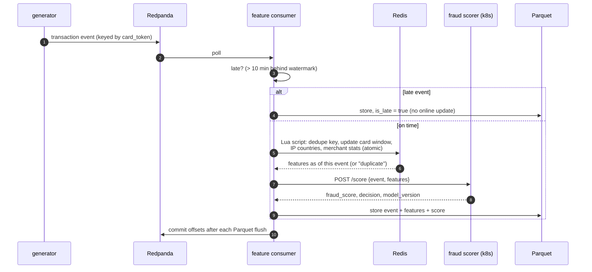
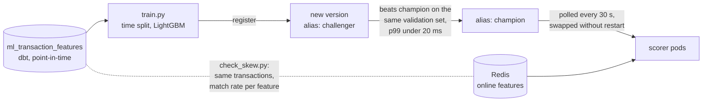
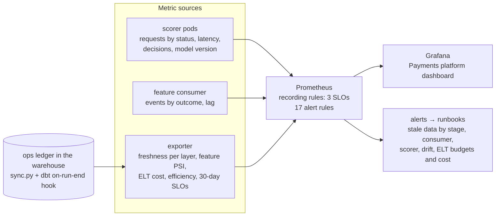

# Architecture

A local payments data platform: a synthetic card-payments source, batch ELT into a warehouse,
real-time fraud features and scoring, governance controls, MLOps, Kubernetes and observability.
Each section is one view; the [ADRs](adr/README.md) record why it's built this way.

## 1. System overview

What exists and how data moves. Batch flows left to right along the top, real time along the
bottom; both meet in the model.

## 2. Deployment view

Where each piece runs, and its port on localhost. Everything is one machine: Docker Desktop
(WSL2, 8 GB) hosts the containers and the kind cluster, whose nodes are themselves containers.
Data flow is in the overview above; this view is only about placement.

The connections that cross a boundary, and how:

| From | To | How |
|---|---|---|
| Airflow (Docker) | Postgres source | PyAirbyte starts the Java connector as a sibling container through the mounted Docker socket; the project is mounted at the path Docker's VM uses, so the connector can read its config |
| Airflow (Docker) | `warehouse.duckdb` (host disk) | bind mount; one writer at a time |
| scorer pods (kind) | MLflow, Redis (Docker) | `host.docker.internal` |
| Prometheus (kind) | consumer, exporter (host) | `host.docker.internal:8000` / `:8001` |
| localhost | scorer, Prometheus (kind) | NodePort 30080 is mapped to :8091 at cluster creation; :9090 goes through the `mpp-prometheus-port` socat container, because kind's port mappings can't be changed later |
| Grafana (Docker) | Prometheus (kind) | `host.docker.internal:9090`, via the same bridge |

## 3. Batch pipeline

The `payments_pipeline` DAG. Governance checks are gates: a failure stops the run before bad data
reaches consumers. DuckDB allows one writer, so tasks run one at a time.

## 4. Real-time scoring path

One card transaction, from event to decision. The scorer fails open: if it's down, the event is
still processed and its features stored, without a score.

## 5. Model lifecycle

Training and serving compute the windowed features twice, from the same definitions:
point-in-time in dbt for training, incrementally in the consumer for serving. `check_skew.py`
compares the two for the same transactions. Every other feature is derived by
`ml/features.py`, which training and serving both import, so those can't drift apart.

## 6. Observability

What is measured where, and what alerts on it. Each alert has a runbook in [runbooks/](runbooks/).

