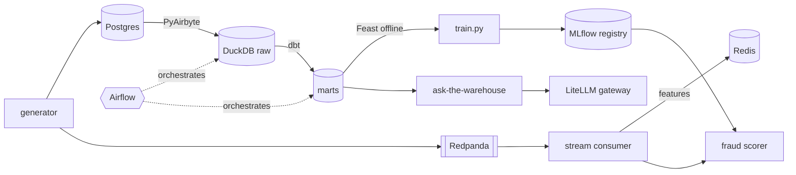

# Architecture

```mermaid
flowchart LR
  G[generator] --> PG[(Postgres)]
  G --> RP[[Redpanda]]
  PG -->|PyAirbyte| RAW[(DuckDB raw)]
  RAW -->|dbt| MARTS[(marts)]
  AF{{Airflow}} -.orchestrates.-> RAW
  AF -.orchestrates.-> MARTS
  MARTS -->|Feast offline| TRAIN[train.py] --> MLF[(MLflow registry)]
  RP --> SC[stream consumer] -->|features| RD[(Redis)]
  SC --> SV[fraud scorer]
  MLF --> SV
  MARTS --> ASK[ask-the-warehouse] --> GW[LiteLLM gateway]
```
